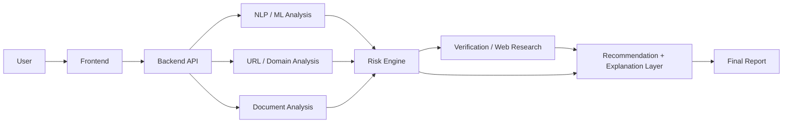
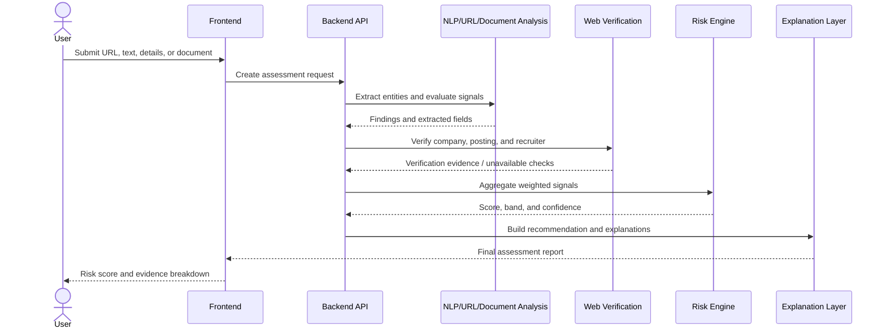

# HireShield-AI

[](./README.md)
[](./README.md)
[](./README.md)

HireShield-AI is an opportunity-credibility assessment system for students, freshers, and job seekers. It evaluates job and internship listings before application using hybrid AI/ML, NLP, rule-based risk detection, document inspection, URL/domain analysis, and independent public-web verification.

## Table of Contents

- [Problem](#problem)
- [Approach](#approach)
- [System Architecture](#system-architecture)
- [Pipeline Flow](#pipeline-flow)
- [Core Scoring and Intelligence Engine](#core-scoring-and-intelligence-engine)
- [Tech Stack](#tech-stack)
- [Datasets and Knowledge Bases](#datasets-and-knowledge-bases)
- [Output](#output)
- [Local Setup](#local-setup)
- [Project Structure](#project-structure)
- [Privacy and Safety Design](#privacy-and-safety-design)
- [Team](#team)

## Problem

Job scams commonly imitate legitimate recruiting processes through cloned domains, unverified recruiter identities, advance-payment requests, urgency language, and inconsistent offer documents. Individual signals are weak in isolation: a real company may use a third-party job board, while a polished offer letter may still contain fraudulent payment clauses.

HireShield-AI aggregates these signals into an explainable risk assessment. It is designed to support a decision, not to establish legal fact or replace independent judgment.

## Approach

The system accepts a job/internship URL, pasted description, company or recruiter details, recruitment email/message, and uploaded offer letters or PDFs.

1. **Extraction** — Convert URL, text, and documents into structured entities such as company name, role title, compensation, location, recruiter email, contact details, and payment terms.
2. **AI/ML and NLP analysis** — Detect financial-scam indicators, urgency or pressure language, unrealistic promises, and recruitment-process red flags.
3. **URL and website analysis** — Inspect HTTPS, redirects, domain age/reputation where available, company-domain mismatches, and whether a source is an official site, a third-party platform, or suspicious.
4. **External verification** — Independently check company existence, official careers pages, job-posting presence, and recruiter identity against public sources.
5. **Document analysis** — Review offer letters and PDFs for consistency, formatting anomalies, payment clauses, and conflicts with verified public information.
6. **Risk scoring** — Aggregate weighted category scores into a normalized 0–100 risk score.
7. **Recommendation** — Produce `APPLY`, `HOLD`, or `DON'T APPLY` based on risk band, evidence coverage, and confidence.
8. **Explainable output** — Return each risk factor with severity, evidence, source status, and confidence level.

## System Architecture



## Pipeline Flow



## Core Scoring and Intelligence Engine

HireShield-AI uses a hybrid detector: ML prediction, deterministic rules, URL analysis, company/recruiter verification, document analysis, and cross-source information consistency are combined in a single Risk Engine. Model output is one signal among several; it does not override high-severity evidence such as advance-payment demands or a verified domain mismatch.

| Category | Weight | Example signals |
| --- | ---: | --- |
| Job Content Analysis | 20% | Vague role scope, unrealistic salary, missing employer details |
| Company Verification | 20% | Company/careers-page presence, public business footprint, posting match |
| Recruiter Verification | 15% | Email-domain match, public professional identity, contact consistency |
| URL/Website Analysis | 15% | HTTPS, redirects, official-domain match, platform classification |
| Financial/Scam Signals | 15% | Registration fees, deposits, payment requests, urgency language |
| Document Analysis | 10% | Offer-letter structure, payment clauses, logo/contact anomalies |
| Information Consistency | 5% | Conflicts across listing, email, document, and public sources |

| Risk score | Risk band | Default recommendation |
| ---: | --- | --- |
| 0–30 | Low | 🟢 APPLY |
| 31–60 | Moderate | 🟡 HOLD |
| 61–80 | High | 🔴 DON'T APPLY |
| 81–100 | Very High | 🔴 DON'T APPLY |

Thresholds are policy configuration, not fixed truth. Missing evidence reduces confidence and can result in `HOLD` even when the score is below a rejection threshold.

## Tech Stack

The repository is currently documentation-only; the table describes the intended implementation stack and should be updated when components are added.

| Layer | Intended technology | Responsibility |
| --- | --- | --- |
| Frontend | React | Submission workflow, report visualization, explanations |
| Backend API | FastAPI or Node.js | Assessment orchestration and API endpoints |
| Database | MongoDB or PostgreSQL | Assessments, extracted entities, evidence, audit metadata |
| ML models | Logistic Regression, Random Forest, SVM; transformer classifier as stretch goal | Baseline and advanced job-scam classification |
| NLP | spaCy, Hugging Face Transformers | Entity extraction, text classification, signal detection |
| Verification | `requests`, BeautifulSoup, or equivalent | Public-page retrieval and structured verification checks |
| Deployment | Vercel (frontend), Render or Railway (backend) | Managed web deployment |

## Datasets and Knowledge Bases

| Source | Use in the system | Notes |
| --- | --- | --- |
| Kaggle — “Real or Fake Job Posting” dataset | Supervised baseline training and evaluation | Validate labels, class balance, licensing, and feature leakage before use |
| Official company websites and careers pages | Company and posting verification | Treat unavailable pages as unknown, not fraudulent |
| Public professional/company directories | Recruiter and company corroboration | Evidence only; respect site terms and rate limits |
| URL/domain metadata sources | Domain and redirect risk checks | Keep source and retrieval time with each result |
| Curated scam-pattern rules | Payment, impersonation, urgency, and contact-pattern detection | Version rules and retain matching evidence |

## Output

Each assessment returns:

- A **risk score** from 0–100.
- A recommendation: **🟢 APPLY**, **🟡 HOLD**, or **🔴 DON'T APPLY**.
- An explainable risk-factor breakdown by category and severity: **🔴 High**, **🟠 Medium**, or **🟢 Low**.
- A confidence level reflecting evidence completeness and signal agreement.
- Verification evidence marked **✓ verified** or **⚠ unable to verify**, with the associated source/check.

## Local Setup

The commands below define the expected development workflow once the application scaffold exists. Replace placeholder values and package commands if the final implementation differs.

### 1. Clone

```bash
git clone https://github.com/niraj-mx07/HireShield-AI.git
cd HireShield-AI
```

### 2. Configure and install the backend

```bash
cd backend
cp .env.example .env
# Set DATABASE_URL, CORS_ORIGINS, and any verification-provider credentials in .env
pip install -r requirements.txt
```

### 3. Configure and install the frontend

```bash
cd ../frontend
cp .env.example .env
# Set the backend API base URL, for example VITE_API_BASE_URL
npm install
```

### 4. Run locally

Run these from separate terminals:

```bash
cd backend
uvicorn app.main:app --reload
```

```bash
cd frontend
npm run dev
```

## Project Structure

This is the proposed application layout; only the root documentation is present at this stage.

```text
HireShield-AI/
├── README.md
├── frontend/
│   ├── src/
│   │   ├── components/
│   │   ├── pages/
│   │   └── services/
│   └── .env.example
├── backend/
│   ├── app/
│   │   ├── api/
│   │   ├── services/
│   │   ├── analyzers/
│   │   ├── models/
│   │   └── main.py
│   ├── requirements.txt
│   └── .env.example
├── ml/
│   ├── training/
│   ├── evaluation/
│   └── artifacts/
├── data/
│   └── README.md
└── docs/
    └── architecture.md
```

## Privacy and Safety Design

- Treat uploaded offers, email addresses, phone numbers, and recruiter details as sensitive data.
- Minimize collection and retain raw inputs only as long as required for the assessment and user-visible history.
- Encrypt data in transit and at rest; restrict document access to the submitting user and authorized service components.
- Redact or hash personal identifiers in logs, analytics, training data, and error reports.
- Record evidence provenance, retrieval time, and rule/model version for auditability.
- Do not make unqualified claims that a company or person is fraudulent. Present risk indicators, verification limits, and supporting evidence.
- Require explicit user action before external lookups when submitted content may contain personal information.

## Team

| Member | Role |
|---|---|
| Nihar Patil | Project Lead / Front-end Development |
| Niraj Mahajan| ML and NLP Engineering |
| Vansh Ahire | Data Collection, Testing, and Documentation |
| Deep Patil | Backend Development and Database |

